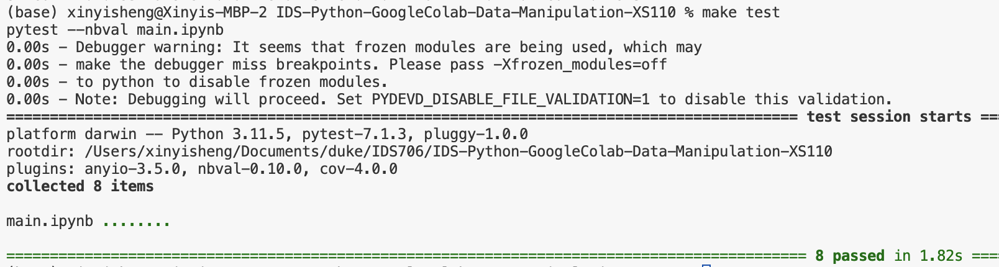

# Cloud-Hosted Notebook Data Manipulation

The project is setting up a Google Colab Jupyte Notebook and performing data manipulation on world population dataset from Kaggle

This repo is generated from template [IDS706-python-Data-Visualization-XS110](https://github.com/nogibjj/IDS706-python-Data-Visualization-XS110)

## Data

The data is from kaggle [world population](https://www.kaggle.com/datasets/iamsouravbanerjee/world-population-dataset). In this Dataset, we have Historical Population data for every Country/Territory in the world by different parameters like Area Size of the Country/Territory, Name of the Continent, Name of the Capital, Density, Population Growth Rate, Ranking based on Population, World Population Percentage, etc.

## Setup

1. Create `main.ipynb` in google drive, then open it with Google Colab
2. Upload `world_population.csv` to Google Colab environment
3. Select Runtime type (CPU, GPU)

## Google Colab main.ipynb
I created the data manipulation and visualzation of world population in `main.ipynb`, the results is in [main.ipynb](https://colab.research.google.com/drive/1NuWMTKrOXkfrruBHvd5i6SX75ssJjtov#scrollTo=rsN_gudN3cXg)

## Results

The code pass the test:

## Data Visualization

I analysed the 234 countries' population in 2022, growth rate and Area(km²).

### 1. Summary statistics using the describe method

### 2. Mean, Median and Mode

### 3. Variance and standard deviation

### 4. histogram of 2022 population

### 5. boxplot of 2022 population

